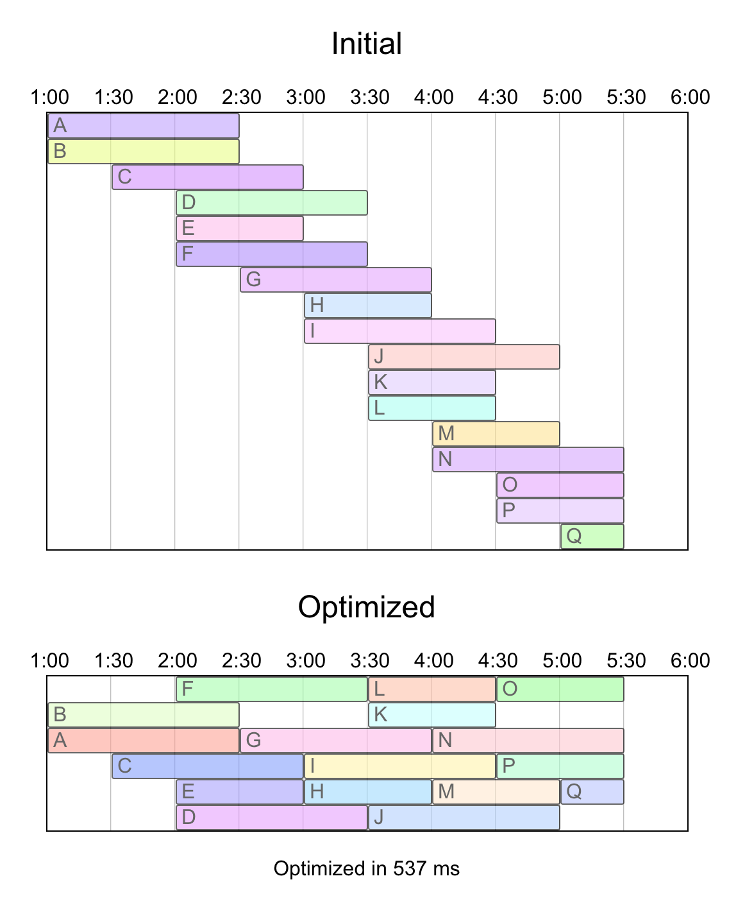

# Simulate Annealing

This project uses [Simulate Annealing](https://en.wikipedia.org/wiki/Simulated_annealing) technique, to optimize a scheduling table to use as few rows as possible.

Initially, the table contains one event per row. An event has a starting and ending time.

It optimizes and moves the events up and down (it does not change start and end values) until it finds the solution that is closest to best.

## Optimization

### Acceptance Function

Rules to find best solution, and how the acceptance function treats each solution:

- Events cannot overlap: acceptance function places a huge penalty for each overlap.
- The more events are in a row, the better: penalty is based on total space available.
- The less rows occupied, the better: there's a penalty for each row.

It runs the optimization in a WebWorker so it does not block the main thread. As it goes through the solutions it renders progress on the browser.

### Neighbour Function

The SA technique requires a neighbour solution to be similar to the current one, when exploring possible solutions. The neighbour is created on the following criteria:

- It rolls a 6 sided dice.
- If dice roll result is 1, or if the table has 3 or less rows, then remove a block from a row and place it as a new row.
- If dice roll results 2, 3 or 4, two rows swap a block.
- Else, move one block to another row (possibly making the table a row shorter).

## Requirements

- NodeJS 10+
- Any modern browser

## Setup

- Clone this repository.
- `npm i`
- `npm run start`

## Credits

The code for the Simulate Annealing algorithm is credited to [saveryanov/simulated-annealing](https://github.com/saveryanov/simulated-annealing).
